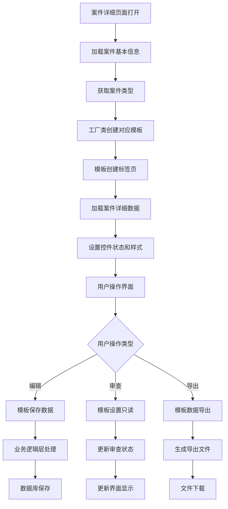

# 案件类型Tab模板切换功能说明

## 功能概述

案件详细页面支持根据不同案件类型自动切换不同的TabControl模板，提供更专业和针对性的界面布局。该功能采用工厂模式和模板模式设计，具有良好的扩展性和维护性。

## 功能特点

### 1. 动态模板切换
- 根据案件类型自动选择对应的Tab模板
- 支持产品案件、服务案件、通用案件等多种模板
- 模板切换无需重启应用程序

### 2. 模块化设计
- 采用接口设计，便于扩展新的案件类型
- 基础模板类提供通用功能
- 具体模板类实现特定业务逻辑

### 3. 数据一致性
- 模板数据与数据库结构保持一致
- 支持数据的加载、保存、验证
- 审查状态与模板控件状态同步

## 技术架构

### 1. 接口层 (ITabTemplate)
```vb
Public Interface ITabTemplate
    Sub CreateTabPages(tabControl As TabControl)
    Sub LoadData(caseDetails As List(Of CaseDetail))
    Function SaveData() As Dictionary(Of Integer, Dictionary(Of String, String))
    Sub SetReadOnly(readOnly As Boolean)
    Sub SetStyle(backColor As Color)
    Function GetSupportedCaseTypes() As List(Of String)
    Function GetTemplateName() As String
    Function GetTabCount() As Integer
    Function GetTabNames() As String()
End Interface
```

### 2. 基础模板类 (BaseTabTemplate)
- 实现通用的模板功能
- 提供控件创建、数据加载、样式设置等基础方法
- 支持递归控件遍历和数据绑定

### 3. 具体模板类
- **ProductCaseTemplate**: 产品案件模板
- **ServiceCaseTemplate**: 服务案件模板  
- **DefaultCaseTemplate**: 默认案件模板

### 4. 工厂类 (TabTemplateFactory)
- 根据案件类型创建对应模板
- 管理模板注册和映射关系
- 提供模板信息查询功能

## 模板类型说明

### 1. 产品案件模板 (ProductCaseTemplate)
**适用案件类型**: 产品案件、新产品、产品变更、产品认证、产品备案

**标签页结构**:
1. 基本信息 - 案件编号、案件名称、申请日期等
2. 产品信息 - 产品代码、产品名称、产品类型等
3. 技术参数 - 技术标准、主要参数、技术要求等
4. 质量标准 - 质量标准、检验方法、合格标准等
5. 生产信息 - 生产厂家、生产地址、生产能力等
6. 检验信息 - 检验机构、检验日期、检验结果等
7. 包装信息 - 包装方式、包装材料、包装规格等
8. 备注信息 - 案件备注
9. 履历信息 - 案件处理历史

### 2. 服务案件模板 (ServiceCaseTemplate)
**适用案件类型**: 服务案件、服务认证、服务备案、服务变更、服务评估

**标签页结构**:
1. 基本信息 - 案件编号、案件名称、申请日期等
2. 服务信息 - 服务代码、服务名称、服务类型等
3. 服务标准 - 服务标准、质量标准、响应时间等
4. 服务流程 - 服务流程、关键节点、时间要求等
5. 人员信息 - 服务人员、人员资质、培训情况等
6. 设备信息 - 服务设备、设备型号、设备状态等
7. 质量保证 - 质量体系、监控方法、改进措施等
8. 备注信息 - 案件备注
9. 履历信息 - 案件处理历史

### 3. 默认案件模板 (DefaultCaseTemplate)
**适用案件类型**: 通用案件、其他案件、未分类案件

**标签页结构**:
1. 基本信息 - 案件编号、案件名称、案件类型等
2. 案件详情 - 案件描述、处理要求、相关法规等
3. 相关文件 - 文件清单、文件路径、文件状态等
4. 处理记录 - 处理步骤、处理结果、处理意见等
5. 备注信息 - 案件备注
6. 履历信息 - 案件处理历史

## 工作流程



## 核心方法说明

### 1. 模板创建
```vb
' 根据案件类型创建模板
_currentTemplate = TabTemplateFactory.CreateTemplate(_caseInfo.CaseType, tabControl)

' 使用模板创建标签页
_currentTemplate.CreateTabPages(tabControl)

' 加载数据到模板
_currentTemplate.LoadData(_caseDetails)
```

### 2. 数据保存
```vb
' 使用模板保存数据
If _currentTemplate IsNot Nothing Then
    Dim savedData = _currentTemplate.SaveData()
    Dim success As Boolean = BusinessLogic.CaseManager.SaveCaseDataWithTemplate(_caseId, savedData, _currentUser)
End If
```

### 3. 样式设置
```vb
' 设置控件只读状态
_currentTemplate.SetReadOnly(readOnly)

' 设置控件样式
_currentTemplate.SetStyle(backColor)
```

## 扩展指南

### 1. 添加新的案件类型模板

1. **创建新的模板类**
```vb
Public Class NewCaseTemplate
    Inherits BaseTabTemplate
    
    Public Sub New(tabControl As TabControl)
        MyBase.New(tabControl)
        _tabNames = {"基本信息", "专业信息", "备注信息", "履历信息"}
    End Sub
    
    Public Overrides Sub CreateTabPages(tabControl As TabControl)
        ' 实现具体的标签页创建逻辑
    End Sub
    
    Public Overrides Function GetSupportedCaseTypes() As List(Of String)
        Return New List(Of String) From {"新案件类型1", "新案件类型2"}
    End Function
    
    Public Overrides Function GetTemplateName() As String
        Return "新案件模板"
    End Function
End Class
```

2. **在工厂类中注册模板**
```vb
Private Shared Sub RegisterTemplates()
    ' 注册新模板
    RegisterTemplate("新案件类型1", GetType(NewCaseTemplate))
    RegisterTemplate("新案件类型2", GetType(NewCaseTemplate))
End Sub
```

### 2. 自定义控件创建
```vb
Protected Sub CreateCustomControls(tabPage As TabPage, y As Integer)
    Dim controls() As (String, String, Control) = {
        ("字段名称", "FieldName", New TextBox),
        ("选择项", "Selection", New ComboBox),
        ("日期", "Date", New DateTimePicker),
        ("描述", "Description", New RichTextBox)
    }
    
    CreateControlGroup(tabPage, controls, y)
End Sub
```

## 数据库设计

### 1. 案件主表 (Cases)
- CaseID: 案件ID
- CaseType: 案件类型（决定使用哪个模板）
- Status: 案件状态
- CreateTime: 创建时间
- CreateUser: 创建用户

### 2. 案件详细表 (CaseDetails)
- CaseID: 案件ID
- TabIndex: 标签页索引
- FieldNo: 字段编号
- FieldValue: 字段值
- FieldStatus: 字段状态
- CreateTime: 创建时间

### 3. 标签页字段映射表 (TabFieldMapping)
- TabIndex: 标签页索引
- FieldNo: 字段编号
- FieldName: 字段名称
- FieldType: 字段类型
- IsRequired: 是否必填
- DefaultValue: 默认值

## 测试用例

### 1. 模板切换测试
- 测试不同案件类型的模板切换
- 验证模板标签页数量正确
- 确认模板控件布局正确

### 2. 数据加载测试
- 测试模板数据加载功能
- 验证控件值正确显示
- 确认数据绑定关系正确

### 3. 数据保存测试
- 测试模板数据保存功能
- 验证数据完整性
- 确认数据库更新正确

### 4. 样式设置测试
- 测试模板样式设置功能
- 验证只读状态切换
- 确认颜色显示正确

## 性能优化

### 1. 模板缓存
- 模板实例可以缓存复用
- 减少重复创建开销

### 2. 数据懒加载
- 按需加载标签页数据
- 提高页面响应速度

### 3. 控件复用
- 控件创建时复用对象
- 减少内存占用

## 注意事项

1. **模板一致性**: 确保所有模板实现相同的接口方法
2. **数据验证**: 在模板中实现必要的数据验证逻辑
3. **错误处理**: 模板操作需要完善的异常处理
4. **性能考虑**: 大量控件创建时注意性能优化
5. **用户体验**: 模板切换时保持界面流畅

## 总结

案件类型Tab模板切换功能通过模块化设计实现了灵活的界面定制，支持多种案件类型的专业化处理。该功能具有良好的扩展性，便于后续添加新的案件类型和模板，同时保持了代码的可维护性和系统的稳定性。 