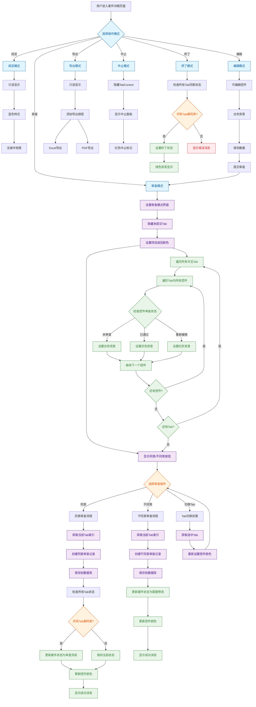
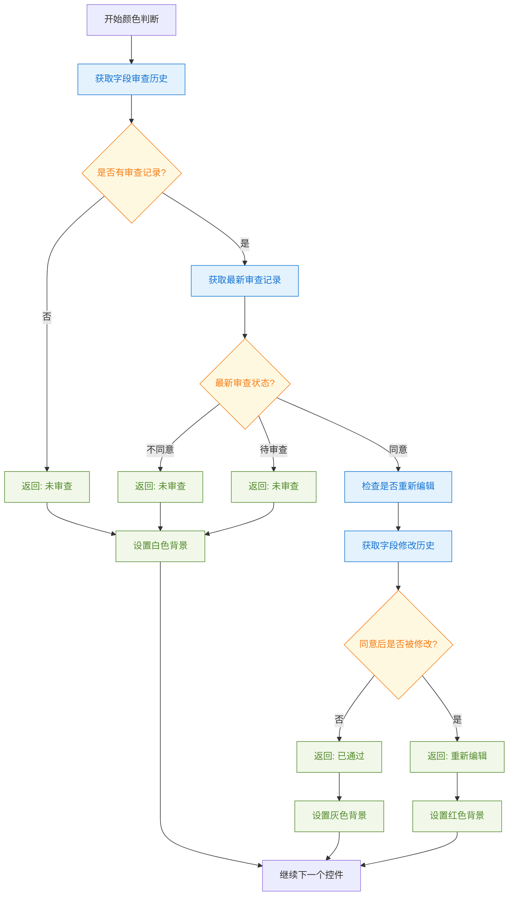
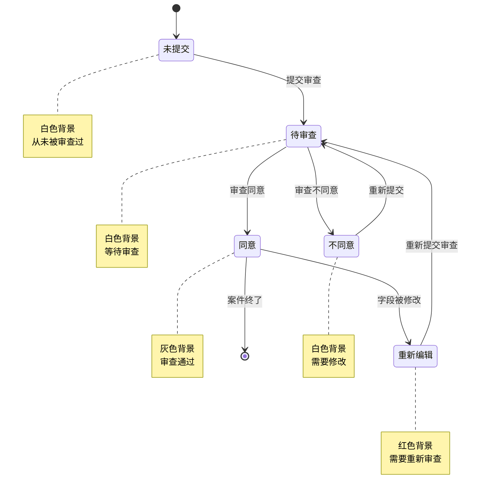
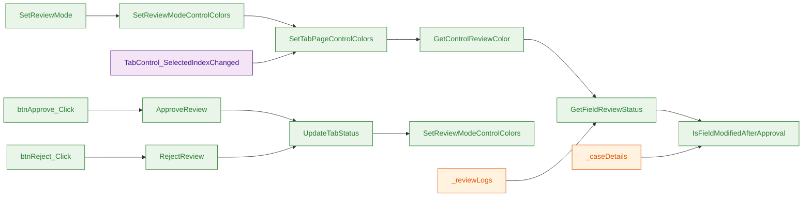

# 案件详细页面审查流程图

## 完整审查流程架构图

## 项目级别颜色判断流程图

## 审查状态转换图

## 核心方法调用关系图

## 审查流程详细步骤

### 1. 进入审查模式
1. 用户点击"审查"按钮
2. 系统调用 `SetReviewMode()`
3. 隐藏未提交的标签页
4. 调用 `SetReviewModeControlColors()` 设置颜色
5. 显示同意/不同意按钮

### 2. 项目级别颜色设置
1. 遍历所有可见标签页
2. 对每个标签页调用 `SetTabPageControlColors()`
3. 遍历标签页内所有控件
4. 对每个控件调用 `GetControlReviewColor()`
5. 根据审查状态设置不同颜色

### 3. 审查操作处理
1. 用户选择同意或不同意
2. 调用对应的业务逻辑方法
3. 保存审查记录到数据库
4. 更新案件状态
5. 重新设置控件颜色
6. 显示操作结果

### 4. 标签页切换
1. 用户切换标签页
2. 触发 `TabControl_SelectedIndexChanged` 事件
3. 重新设置当前标签页的控件颜色

## 颜色规则总结

| 审查状态 | 背景颜色 | 含义 | 触发条件 |
|---------|---------|------|----------|
| 未审查 | 白色 | 需要审查 | 从未审查过或最新状态为"不同意" |
| 已通过 | 灰色 | 审查通过 | 最新状态为"同意"且未重新编辑 |
| 重新编辑 | 红色 | 需要重新审查 | 同意后被重新编辑并提交 |

## 技术实现要点

### 1. 数据依赖
- `_reviewLogs`: 审查记录历史
- `_caseDetails`: 字段修改历史
- `control.Tag`: 字段标识

### 2. 性能优化
- 只在审查模式下设置颜色
- 只在必要时更新颜色
- 使用缓存避免重复计算

### 3. 用户体验
- 颜色变化实时生效
- 颜色区分明显
- 操作反馈及时

这个流程图完整展示了案件详细页面的审查流程，特别是新增的项目级别颜色显示功能，帮助审查人员更高效地进行案件审查工作。 