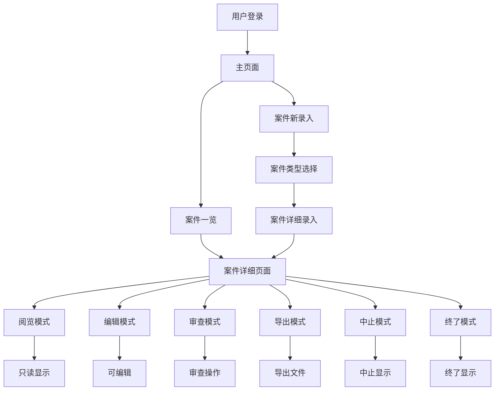
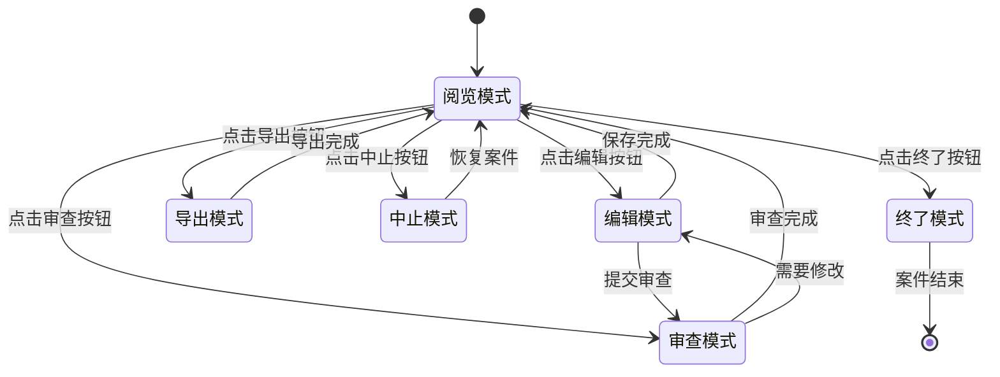

# 案件详细页面流程图

## 系统架构图

## 文件功能说明

### 1. 窗体层 (Forms)

#### CaseDetailForm.vb - 案件详细页面窗体
**功能：** 案件详细页面的主窗体，支持多种状态切换
- **主要职责：**
  - 显示案件详细信息
  - 管理6种状态（阅览、编辑、审查、导出、中止、终了）
  - 处理9个TabPage的内容
  - 响应用户操作和状态切换
- **核心方法：**
  - `SetStatus()` - 设置当前状态
  - `LoadCaseData()` - 加载案件数据
  - `CreateTabPages()` - 创建标签页
  - `UpdateTabStatus()` - 更新标签页状态

#### CaseListForm.vb - 案件一览窗体
**功能：** 显示案件列表，支持搜索和双击打开详细页面
- **主要职责：**
  - 显示所有案件列表
  - 提供多条件搜索功能
  - 双击打开案件详细页面
  - 显示案件状态和中止标记
- **核心方法：**
  - `LoadCases()` - 加载案件数据
  - `SearchCases()` - 搜索案件
  - `RefreshDataGridView()` - 刷新显示
  - `dgvCases_CellDoubleClick()` - 双击事件处理

#### MainForm.vb - 主窗体
**功能：** 系统主页面，提供功能导航
- **主要职责：**
  - 提供功能按钮导航
  - 管理用户会话
  - 跳转到各个功能页面
- **核心方法：**
  - `btnNewCase_Click()` - 新建案件
  - `btnCaseList_Click()` - 案件一览

#### CaseDetailEntryForm.vb - 案件详细录入窗体
**功能：** 新建案件的详细录入页面
- **主要职责：**
  - 新案件的数据录入
  - 9个TabPage的数据收集
  - 保存新案件数据
- **核心方法：**
  - `CreateTabPages()` - 创建标签页
  - `btnSubmit_Click()` - 提交新案件

#### LoginForm.vb - 登录窗体
**功能：** 用户登录验证
- **主要职责：**
  - 用户身份验证
  - 登录状态管理
  - 跳转到主页面

#### CaseTypeSelectForm.vb - 案件类型选择窗体
**功能：** 选择案件类型
- **主要职责：**
  - 显示案件类型列表
  - 跳转到案件录入页面

### 2. 业务逻辑层 (BusinessLogic)

#### CaseManager.vb - 案件管理业务逻辑
**功能：** 案件相关的所有业务逻辑处理
- **主要职责：**
  - 案件数据的增删改查
  - 审查流程管理
  - 状态转换逻辑
  - 数据验证和处理
- **核心方法：**
  - `CreateNewCase()` - 创建新案件（包含字段数据和DGV数据的审查记录创建逻辑）
  - `SaveCaseData()` - 保存案件数据
  - `SubmitForReview()` - 提交审查
  - `ApproveReview()` - 同意审查
  - `RejectReview()` - 不同意审查
  - `TerminateCase()` - 中止案件
  - `RestoreCase()` - 恢复案件
  - `FinishCase()` - 终了案件
  - `ExportToExcel()` - 导出Excel
  - `ExportToPDF()` - 导出PDF

### 3. 数据访问层 (DataAccess)

#### CaseRepository.vb - 案件数据访问
**功能：** 案件数据的数据库操作
- **主要职责：**
  - 案件基本信息的CRUD操作
  - 案件详细信息的批量操作
  - 审查记录的创建和查询
  - 案件状态更新
- **核心方法：**
  - `CreateCase()` - 创建案件
  - `GetCaseById()` - 根据ID获取案件
  - `GetCaseDetailsByCaseId()` - 获取案件详细信息
  - `GetReviewLogsByCaseId()` - 获取审查记录
  - `SaveCaseDetails()` - 保存详细信息
  - `CreateReviewLog()` - 创建审查记录
  - `UpdateCaseStatus()` - 更新案件状态
  - `SearchCases()` - 搜索案件

#### UserRepository.vb - 用户数据访问
**功能：** 用户数据的数据库操作
- **主要职责：**
  - 用户登录验证
  - 用户信息管理
  - 权限验证

#### DbHelper.vb - 数据库帮助类
**功能：** 数据库连接和操作的基础类
- **主要职责：**
  - 数据库连接管理
  - SQL执行封装
  - 事务处理

### 4. 模型层 (Models)

#### CaseInfo.vb - 案件信息实体
**功能：** 案件基本信息的实体类
- **主要属性：**
  - CaseID - 案件ID
  - CaseType - 案件类型
  - CaseName - 案件名称
  - ProductCode - 产品代码
  - ProductName - 产品名称
  - Status - 状态
  - IsTerminated - 是否中止
  - CreateTime - 创建时间
  - CreateUser - 创建用户

#### CaseDetail.vb - 案件详细信息实体
**功能：** 案件详细信息的实体类
- **主要属性：**
  - DetailID - 详细信息ID
  - CaseID - 案件ID
  - TabIndex - 标签页索引
  - FieldNo - 字段编号
  - FieldValue - 字段值
  - FieldStatus - 字段状态

#### ReviewLog.vb - 审查记录实体
**功能：** 审查记录的实体类
- **主要属性：**
  - ReviewID - 审查记录ID
  - CaseID - 案件ID
  - TabIndex - 标签页索引
  - ReviewerID - 审查人ID
  - ReviewStatus - 审查状态
  - ReviewTime - 审查时间

#### UserInfo.vb - 用户信息实体
**功能：** 用户信息的实体类
- **主要属性：**
  - UserID - 用户ID
  - UserName - 用户名
  - Password - 密码
  - Role - 角色

### 5. 工具类 (Utils)

#### LogUtil.vb - 日志工具类
**功能：** 系统日志记录
- **主要职责：**
  - 错误日志记录
  - 操作日志记录
  - 日志文件管理

### 6. 枚举和常量

#### UserRoles.vb - 用户角色枚举
**功能：** 定义用户角色类型
- **枚举值：**
  - Admin - 管理员
  - User - 普通用户
  - Reviewer - 审查人

#### GlobalStrings.vb - 全局字符串常量
**功能：** 系统全局字符串常量
- **主要常量：**
  - 错误消息
  - 提示信息
  - 状态文本

## 案件详细页面状态流程

## 数据流向图

## 技术架构特点

1. **分层架构：** 严格按照UI层、业务逻辑层、数据访问层分离
2. **单一职责：** 每个类都有明确的职责分工
3. **数据绑定：** 使用Tag属性实现控件与数据库字段的绑定
4. **状态管理：** 通过状态模式管理不同的界面状态
5. **错误处理：** 统一的异常处理和日志记录
6. **用户权限：** 基于角色的权限控制
7. **数据验证：** 多层数据验证确保数据完整性

## 扩展性设计

1. **TabPage扩展：** 可以轻松添加新的标签页
2. **字段扩展：** 通过Tag属性可以动态添加新字段
3. **状态扩展：** 可以添加新的案件状态
4. **导出扩展：** 支持多种导出格式
5. **权限扩展：** 可以添加新的用户角色和权限 