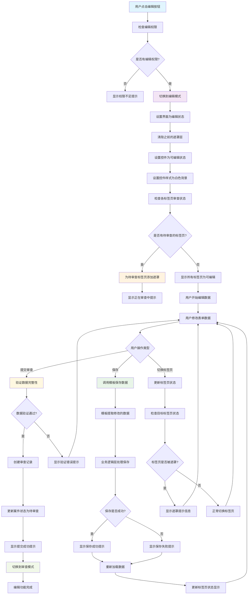
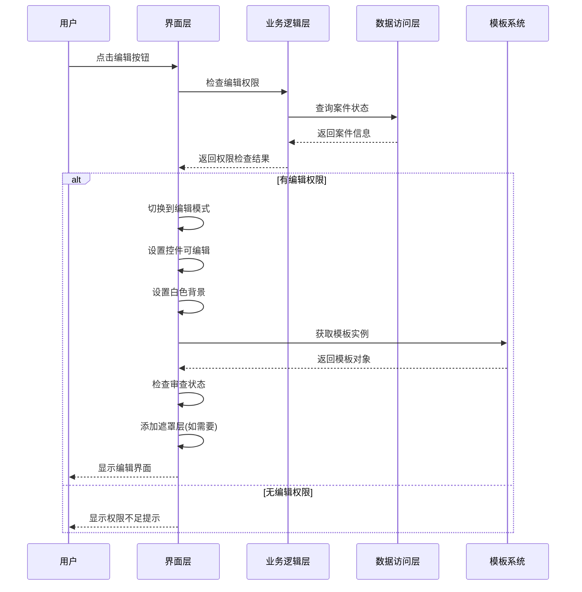
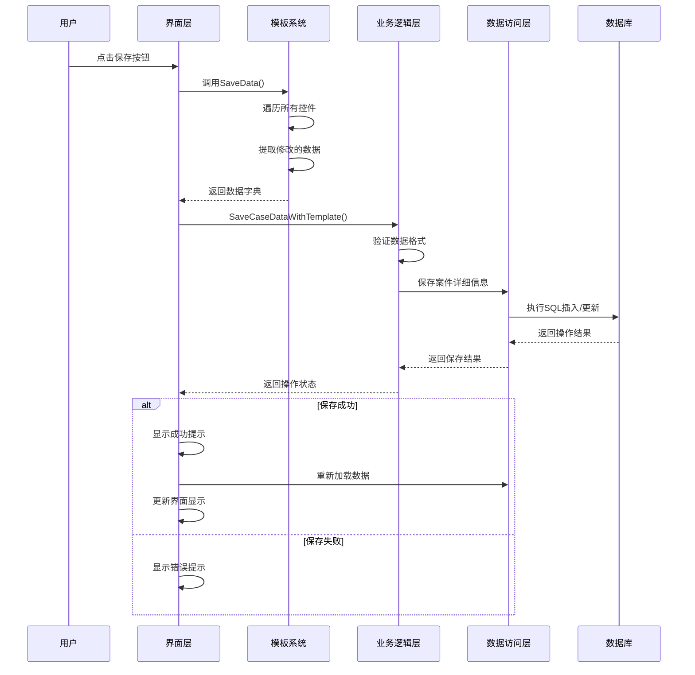
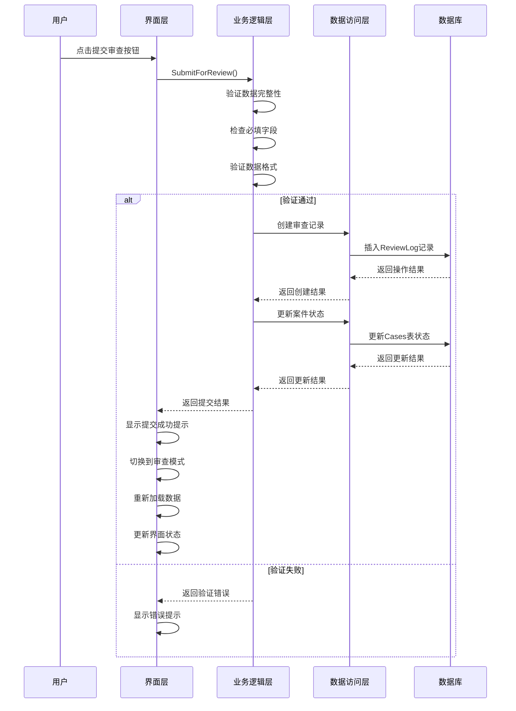
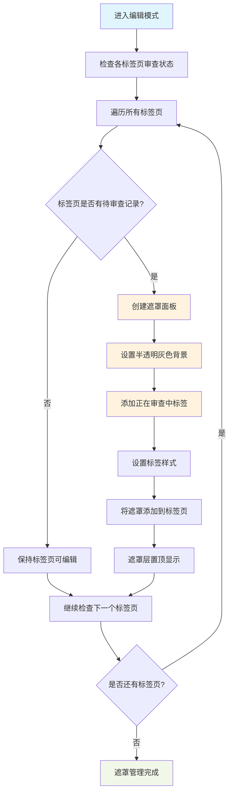
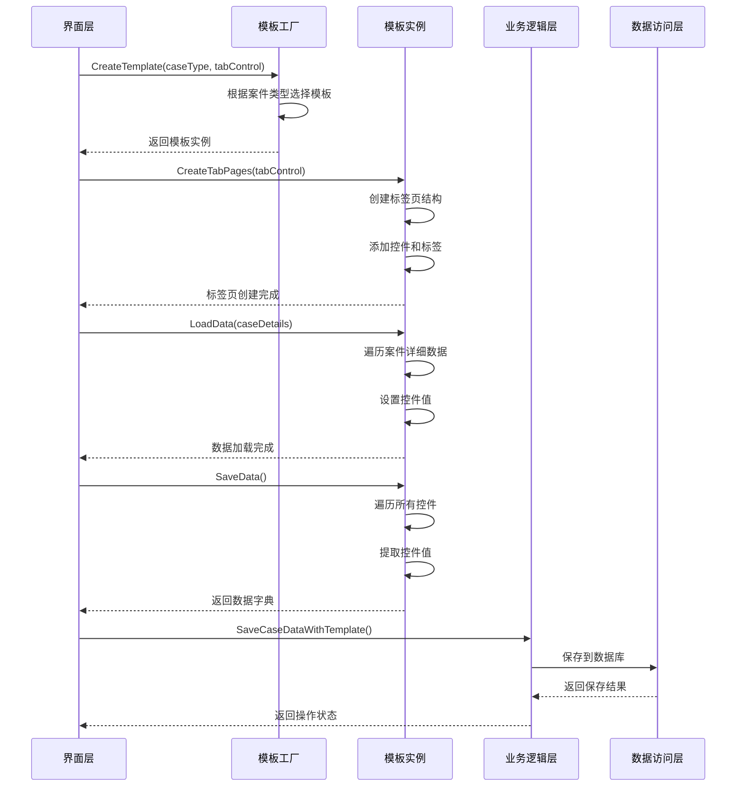
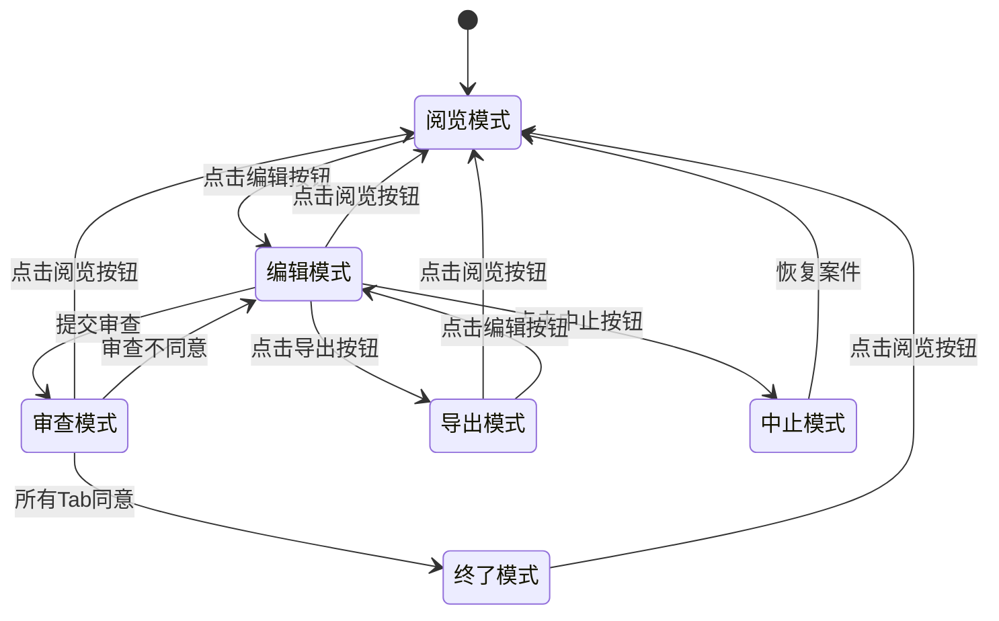

# 案件详细页面编辑功能流程图

## 功能概述
案件详细页面编辑功能支持用户对案件信息进行修改、保存和提交审查，包含模板切换、数据验证、遮罩显示等特性。

## 编辑功能流程图



## 详细流程说明

### 1. 编辑模式启动流程



### 2. 数据保存流程



### 3. 提交审查流程



### 4. 遮罩管理流程



### 5. 模板数据交互流程



## 关键代码实现

### 1. 编辑模式设置
```vb
Private Sub SetEditMode()
    ' 编辑模式：可编辑，已提交审查的Tab显示遮罩
    tabControl.Visible = True
    panelTerminated.Visible = False
    lblTerminated.Visible = False
    
    SetControlsReadOnly(False)
    SetControlsStyle(Color.White)
    
    ' 为已提交审查的Tab添加遮罩
    AddReviewingOverlays()
    
    ' 添加保存和审查按钮
    AddActionButtons()
End Sub
```

### 2. 数据保存处理
```vb
Private Sub btnSave_Click(sender As Object, e As EventArgs)
    Try
        ' 使用模板保存案件数据
        If _currentTemplate IsNot Nothing Then
            Dim savedData = _currentTemplate.SaveData()
            Dim success As Boolean = BusinessLogic.CaseManager.SaveCaseDataWithTemplate(_caseId, savedData, _currentUser)
            If success Then
                MessageBox.Show("保存成功！", "提示", MessageBoxButtons.OK, MessageBoxIcon.Information)
                ' 重新加载数据
                LoadCaseData()
                UpdateTabStatus()
            Else
                MessageBox.Show("保存失败！", "错误", MessageBoxButtons.OK, MessageBoxIcon.Error)
            End If
        Else
            MessageBox.Show("模板未初始化！", "错误", MessageBoxButtons.OK, MessageBoxIcon.Error)
        End If
    Catch ex As Exception
        MessageBox.Show($"保存失败：{ex.Message}", "错误", MessageBoxButtons.OK, MessageBoxIcon.Error)
        Utils.LogUtil.LogError("保存案件数据失败", ex)
    End Try
End Sub
```

### 3. 遮罩层管理
```vb
Private Sub AddReviewingOverlays()
    ' 清除之前的遮罩
    ClearReviewingOverlays()
    
    ' 为已提交审查的Tab添加遮罩层
    For i As Integer = 0 To 8
        Dim tabPage As TabPage = tabControl.TabPages(i)
        Dim tabReviewLogs = _reviewLogs.Where(Function(r) r.TabIndex = i).ToList()
        
        If tabReviewLogs.Count > 0 Then
            ' 检查是否有待审查的记录
            Dim hasPendingReview = tabReviewLogs.Any(Function(r) r.ReviewStatus = "待审查")
            
            If hasPendingReview Then
                ' 创建遮罩面板
                Dim overlayPanel As New Panel With {
                    .Dock = DockStyle.Fill,
                    .BackColor = Color.FromArgb(128, 200, 200, 200), ' 半透明灰色
                    .Visible = True,
                    .Name = $"overlay_{i}"
                }
                
                ' 添加"正在审查中"标签
                Dim lblReviewing As New Label With {
                    .Text = "正在审查中",
                    .Font = New Font("微软雅黑", 14, FontStyle.Bold),
                    .ForeColor = Color.DarkBlue,
                    .AutoSize = True,
                    .Location = New Point(50, 50)
                }
                overlayPanel.Controls.Add(lblReviewing)
                
                ' 添加遮罩到TabPage
                tabPage.Controls.Add(overlayPanel)
                overlayPanel.BringToFront()
            End If
        End If
    Next
End Sub
```

## 状态转换图



## 错误处理流程

```mermaid
flowchart TD
    A[操作执行] --> B{是否发生异常?}
    B -->|否| C[操作成功]
    B -->|是| D[捕获异常]
    
    D --> E[记录错误日志]
    E --> F[显示用户友好错误信息]
    F --> G[回滚操作(如需要)]
    G --> H[恢复界面状态]
    H --> I[错误处理完成]
    
    C --> J[更新界面显示]
    J --> K[操作完成]
    
    style A fill:#e1f5fe
    style D fill:#ffebee
    style E fill:#ffebee
    style F fill:#ffebee
    style C fill:#e8f5e8
    style K fill:#e8f5e8
```

## 性能优化要点

1. **模板缓存**: 模板实例可以复用，避免重复创建
2. **数据懒加载**: 按需加载标签页数据
3. **控件复用**: 控件创建时复用对象
4. **异步操作**: 大数据量操作使用异步处理
5. **内存管理**: 及时释放不需要的资源

## 安全考虑

1. **权限验证**: 每次操作前验证用户权限
2. **数据验证**: 输入数据进行格式和范围验证
3. **SQL注入防护**: 使用参数化查询
4. **XSS防护**: 对用户输入进行转义处理
5. **审计日志**: 记录重要操作的审计信息 